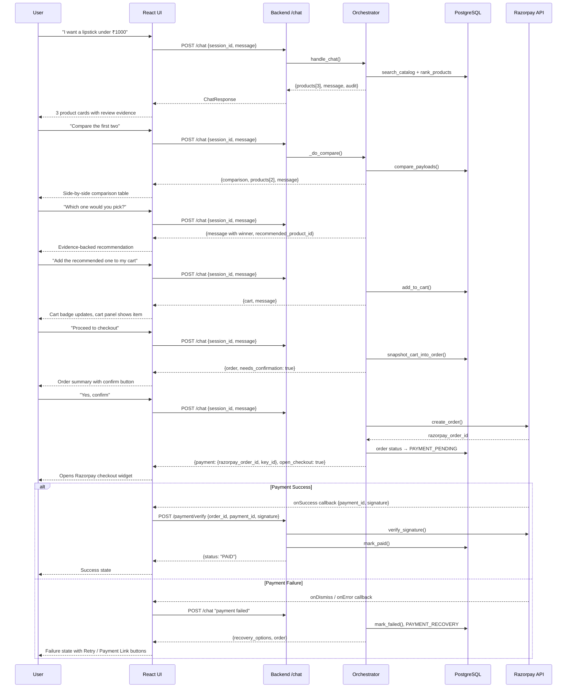
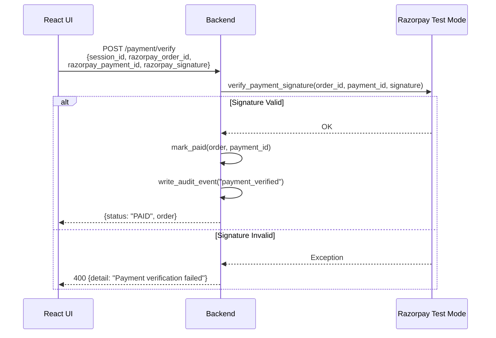
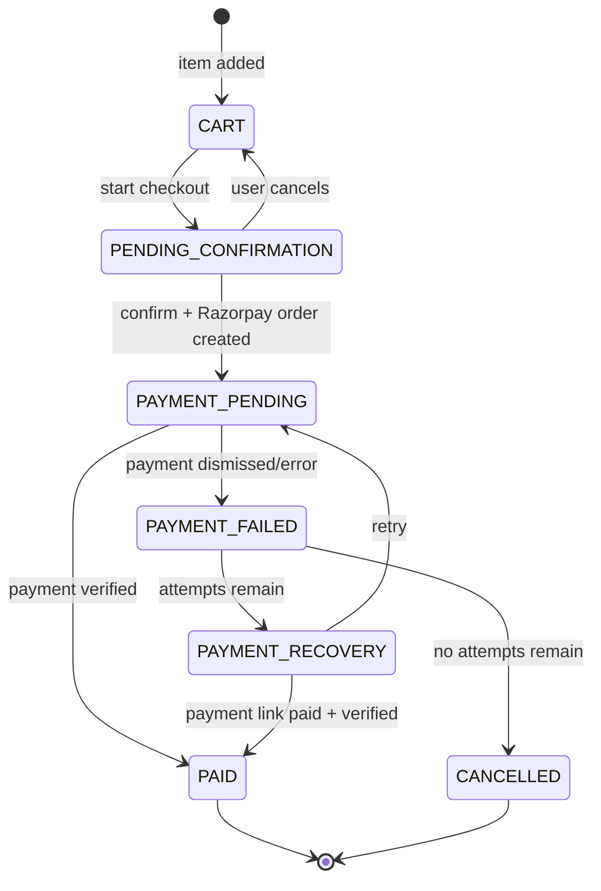

# Design Document: GlowCart Frontend Completion

## Overview

GlowCart is a conversational AI shopping assistant for beauty products built for the Razorpay AI Buildathon. The backend is substantially complete — FastAPI with PostgreSQL, a Gemini-powered orchestrator, and Razorpay Test Mode integration. This feature completes the application by replacing the placeholder Vite frontend with a polished conversational shopping UI, wiring all backend routers in `main.py`, and adding the missing REST endpoints (cart CRUD, checkout, payment verification, payment link, audit retrieval) that the frontend needs to drive the demo flow independently of the chat endpoint.

The design covers both high-level architecture (system topology, data flow, API contract) and low-level structure (component tree, state management, function signatures, API layer).

---

## Architecture

### System Topology

```mermaid
graph TD
    subgraph Browser
        UI[React SPA<br/>Vite dev server :5173]
        RZP[Razorpay.js<br/>Checkout Widget]
    end

    subgraph Backend [:8000]
        MW[CORS Middleware]
        CR[/chat router]
        SR[/session router]
        CARTR[/cart router]
        CHECKR[/checkout router]
        PAYR[/payment router]
        AUDR[/audit router]
        PRODR[/products router]
        ORCH[Orchestrator]
        INTENT[Intent Parser]
        GEM[Gemini Client]
        CART[cart_service]
        ORDER[order_service]
        RZP_SVC[razorpay_service]
        AUDIT[audit_service]
        CAT[catalog_service]
        REC[recommend_service]
        REV[review_service]
        SESSION[session_service]
        DB[(PostgreSQL)]
    end

    subgraph External
        RZPAPI[Razorpay Test Mode API]
        GEMAPI[Gemini API]
    end

    UI -->|POST /chat| CR
    UI -->|GET /session/:id| SR
    UI -->|GET/POST/PATCH/DELETE /cart/*| CARTR
    UI -->|POST /checkout/confirm| CHECKR
    UI -->|POST /payment/verify| PAYR
    UI -->|POST /payment/link| PAYR
    UI -->|GET /audit/:session_id| AUDR
    UI -->|GET /products/search| PRODR

    CR --> ORCH
    ORCH --> INTENT
    ORCH --> GEM
    ORCH --> CART
    ORCH --> ORDER
    ORCH --> RZP_SVC
    ORCH --> AUDIT
    ORCH --> CAT
    ORCH --> REC
    ORCH --> SESSION

    CARTR --> CART
    CHECKR --> ORDER
    PAYR --> RZP_SVC
    PAYR --> ORDER
    AUDR --> AUDIT
    PRODR --> CAT

    CART --> DB
    ORDER --> DB
    AUDIT --> DB
    SESSION --> DB
    CAT --> DB

    RZP_SVC --> RZPAPI
    GEM --> GEMAPI

    UI -.->|open checkout widget| RZP
    RZP -.->|payment callback| UI
    UI -->|POST /payment/verify| PAYR
```

### Request Flow: Demo Shopping Path



### Payment Verification Flow



---

## Backend Changes Required

### 1. Wire Routers in `main.py`

The existing `main.py` only includes `routes.router`. The `backend/routers/chat.py` router is never mounted. Additional routers for cart, checkout, payment, and audit need to be created and mounted.

```python
# main.py additions
from routers.chat import router as chat_router
from routers.cart import router as cart_router
from routers.checkout import router as checkout_router
from routers.payment import router as payment_router
from routers.audit import router as audit_router

app.include_router(chat_router)
app.include_router(cart_router)
app.include_router(checkout_router)
app.include_router(payment_router)
app.include_router(audit_router)
```

### 2. Missing Router Files to Create

#### `backend/routers/cart.py`

Endpoints:
- `GET /cart/{session_id}` — return current cart
- `POST /cart/add` — add item (uses `CartAddRequest`)
- `PATCH /cart/items/{item_id}` — update quantity (uses `CartUpdateRequest`)
- `DELETE /cart/items/{item_id}?session_id=` — remove item

All delegate to `cart_service` — no business logic in the router.

#### `backend/routers/checkout.py`

Endpoints:
- `POST /checkout/start` — calls `snapshot_cart_into_order`, returns order + `needs_confirmation: true`
- `POST /checkout/confirm` — calls `_do_confirm_checkout` logic; creates Razorpay order, returns `payment` block with `open_checkout: true`

#### `backend/routers/payment.py`

Endpoints:
- `POST /payment/verify` — HMAC signature verification via `razorpay_service.verify_signature()`, then `mark_paid()`; writes audit event
- `POST /payment/link` — calls `create_payment_link()`, updates order; writes audit event
- `POST /payment/failed` — calls `mark_failed()`, transitions to PAYMENT_RECOVERY if retries remain

#### `backend/routers/audit.py`

Endpoints:
- `GET /audit/{session_id}` — returns `list_audit_events(db, session_id, limit=50)`

### 3. `razorpay_key_id` Public Endpoint

`GET /payment/key` returns `{"key_id": RAZORPAY_KEY_ID}` so the frontend can retrieve the publishable key without it being bundled into the build.

---

## API Contract

### Shared Response Shape

Every `/chat` response and most checkout/payment endpoints return a consistent envelope:

```typescript
interface ChatResponse {
  session_id: string
  message: string
  products: Product[]
  cart: Cart
  order: Order | null
  payment: PaymentView | null
  comparison: Comparison | null
  audit: AuditEvent[]
  needs_confirmation: boolean
  open_checkout: boolean
  recovery_options: string[]   // ["retry_payment", "payment_link"]
  actions: string[]
  recommended_product_id: number | null
}
```

### Data Shapes

```typescript
interface Product {
  id: number
  asin: string
  name: string
  brand: string | null
  category: string
  description: string | null
  price: number           // INR, synthetic/demo
  currency: string        // "INR"
  rating: number | null
  review_count: number
  image_url: string | null
  inventory: number
  available: boolean
  merchant: string
  pricing_note: string
  // enriched by orchestrator:
  score?: number
  score_factors?: ScoreFactors
  pros?: string[]
  cons?: string[]
  review_evidence?: ReviewEvidence
  why?: string
}

interface ReviewEvidence {
  pros: ReviewTheme[]
  cons: ReviewTheme[]
  samples: ReviewSample[]
  evidence_score: number   // 0..1
  reviews_examined: number
}

interface ReviewTheme {
  label: string
  mentions: number
  excerpts: string[]
}

interface ReviewSample {
  rating: number
  text: string
}

interface Cart {
  session_id: string
  items: CartItem[]
  item_count: number
  subtotal: number
  total: number
  currency: string
  merchant: string
  pricing_note: string
}

interface CartItem {
  id: number
  product_id: number
  name: string
  brand: string | null
  image_url: string | null
  quantity: number
  unit_price: number
  line_total: number
  currency: string
}

interface Order {
  id: number
  session_id: string
  status: OrderStatus
  total_amount: number
  amount_paise: number
  currency: string
  merchant: string
  items: CartItem[]
  razorpay_order_id: string | null
  razorpay_payment_id: string | null
  payment_link_url: string | null
  payment_attempts: number
  max_attempts: number
  attempts_remaining: number
  created_at: string   // ISO-8601
}

type OrderStatus =
  | "CART"
  | "PENDING_CONFIRMATION"
  | "PAYMENT_PENDING"
  | "PAYMENT_FAILED"
  | "PAYMENT_RECOVERY"
  | "PAID"
  | "CANCELLED"

interface PaymentView {
  status: OrderStatus
  razorpay_order_id: string | null
  razorpay_key_id: string | null
  amount: number
  amount_paise: number
  currency: string
  payment_link_url: string | null
  attempts: number
  max_attempts: number
  paid: boolean
}

interface Comparison {
  left: Product
  right: Product
  recommended_id: number
  recommended_name: string
  reasons: string[]
  summary: string
}

interface AuditEvent {
  id: number
  session_id: string | null
  order_id: number | null
  event_type: string
  description: string
  metadata: Record<string, unknown>
  created_at: string
}
```

### Endpoint Reference

| Method | Path | Request Body | Response |
|--------|------|-------------|----------|
| POST | `/chat` | `{session_id, message}` | `ChatResponse` |
| GET | `/session/{session_id}` | — | session state |
| GET | `/cart/{session_id}` | — | `Cart` |
| POST | `/cart/add` | `{session_id, product_id, quantity}` | `Cart` |
| PATCH | `/cart/items/{item_id}` | `{session_id, quantity}` | `Cart` |
| DELETE | `/cart/items/{item_id}?session_id=` | — | `Cart` |
| POST | `/checkout/start` | `{session_id}` | `ChatResponse` subset |
| POST | `/checkout/confirm` | `{session_id, confirm: true}` | `ChatResponse` subset |
| POST | `/payment/verify` | `{session_id, razorpay_order_id, razorpay_payment_id, razorpay_signature}` | `{status, order}` |
| POST | `/payment/link` | `{session_id}` | `{order, payment_link_url}` |
| POST | `/payment/failed` | `{session_id}` | `{order, recovery_options}` |
| GET | `/payment/key` | — | `{key_id}` |
| GET | `/audit/{session_id}` | — | `AuditEvent[]` |
| GET | `/products/search` | query params | `{count, products}` |
| GET | `/products/{id}` | — | `Product` |

---

## Frontend Architecture

### Component Tree

```
App
├── SessionProvider (context: session_id, initialized)
├── ChatProvider (context: messages, isTyping, sendMessage)
├── AppShell
│   ├── Header
│   │   ├── GlowCartLogo
│   │   ├── CartBadge (item_count)
│   │   └── AuditToggle
│   ├── MainLayout
│   │   ├── ChatPanel (flex: 1)
│   │   │   ├── MessageList
│   │   │   │   ├── UserMessage
│   │   │   │   └── AssistantMessage
│   │   │   │       ├── MessageText
│   │   │   │       ├── ProductGrid (when products present)
│   │   │   │       │   └── ProductCard × N
│   │   │   │       │       ├── ProductImage
│   │   │   │       │       ├── ProductMeta (name, brand, price, rating)
│   │   │   │       │       ├── ReviewEvidence (pros/cons chips)
│   │   │   │       │       └── AddToCartButton
│   │   │   │       ├── ComparisonTable (when comparison present)
│   │   │   │       ├── OrderSummary (when needs_confirmation)
│   │   │   │       └── RecoveryOptions (when recovery_options present)
│   │   │   └── ChatInput
│   │   │       ├── MessageTextarea
│   │   │       └── SendButton
│   │   └── SidePanel (collapsible)
│   │       ├── CartPanel
│   │       │   ├── CartItemRow × N
│   │       │   │   ├── ItemThumbnail
│   │       │   │   ├── ItemMeta
│   │       │   │   ├── QuantityStepper
│   │       │   │   └── RemoveButton
│   │       │   ├── CartTotals
│   │       │   └── CheckoutButton
│   │       └── AuditPanel
│   │           └── AuditEventRow × N
│   └── PaymentModal (portal, when open_checkout)
│       ├── RazorpayCheckout (imperative widget trigger)
│       ├── PaymentSuccessView
│       └── PaymentFailureView
│           ├── RetryButton
│           └── PaymentLinkButton
```

### State Management

No external state library is needed. Three React contexts handle the application state:

#### `SessionContext`

```typescript
interface SessionState {
  sessionId: string           // persisted in localStorage
  initialized: boolean
  lastProductIds: number[]
  recommendedProductId: number | null
}
```

Initialized on mount from `localStorage`. If no ID found, a UUID v4 is generated client-side and `GET /session/{id}` is called to bootstrap state.

#### `ChatContext`

```typescript
interface ChatState {
  messages: ChatMessage[]
  isTyping: boolean
  cart: Cart
  order: Order | null
  payment: PaymentView | null
  comparison: Comparison | null
  audit: AuditEvent[]
  openCheckout: boolean
  recoveryOptions: string[]
  needsConfirmation: boolean
  recommendedProductId: number | null
}

interface ChatMessage {
  id: string               // uuid v4, client-generated
  role: "user" | "assistant"
  content: string
  timestamp: string
  products?: Product[]
  comparison?: Comparison
  order?: Order | null
  needsConfirmation?: boolean
  recoveryOptions?: string[]
}
```

`sendMessage(text)` is the single action: it appends a user message optimistically, calls `POST /chat`, then appends the assistant response and merges the response payload into the top-level state fields.

#### `UIContext`

```typescript
interface UIState {
  sidePanelTab: "cart" | "audit"
  sidePanelOpen: boolean
  paymentModalOpen: boolean
}
```

### Key Component Specifications

#### `ChatInput`

```typescript
function ChatInput({
  onSend: (text: string) => void,
  disabled: boolean,
  placeholder: string
}): JSX.Element
```

- Textarea with auto-resize (max 4 rows)
- Enter to send (Shift+Enter for newline)
- Disabled during `isTyping`
- Quick-action chips rendered above input for common intents (shown after first recommendation): "Compare first two", "Which would you pick?", "Add recommended", "Checkout"

#### `ProductCard`

```typescript
function ProductCard({
  product: Product,
  index: number,              // 1-based display number
  isRecommended: boolean,
  onAddToCart: (productId: number) => void
}): JSX.Element
```

- Shows: thumbnail, index badge, name, brand, price (₹), star rating, review count
- Pros shown as green chips, cons as amber chips (from `review_evidence.pros/cons`)
- "Add to cart" button
- Recommended badge (crown icon) when `isRecommended`
- `pricing_note` shown as disclaimer text in small print

#### `ComparisonTable`

```typescript
function ComparisonTable({
  comparison: Comparison
}): JSX.Element
```

Renders a two-column table with rows for: price, rating, review count, pros, cons, score. Winner column highlighted. Summary text and recommended badge shown below table.

#### `OrderSummary`

```typescript
function OrderSummary({
  order: Order,
  onConfirm: () => void,
  onCancel: () => void
}): JSX.Element
```

Shows itemized snapshot, total, merchant, demo pricing disclaimer. Confirm button calls `sendMessage("yes, confirm")`.

#### `RecoveryOptions`

```typescript
function RecoveryOptions({
  options: string[],        // ["retry_payment", "payment_link"]
  attemptsRemaining: number,
  onRetry: () => void,
  onPaymentLink: () => void
}): JSX.Element
```

Only shown when `recovery_options` is non-empty. Buttons disabled when `attemptsRemaining === 0`.

#### `PaymentModal`

```typescript
function PaymentModal({
  payment: PaymentView,
  sessionId: string,
  onSuccess: (result: RazorpaySuccessPayload) => void,
  onFailure: () => void,
  onClose: () => void
}): JSX.Element
```

Triggers the Razorpay checkout widget imperatively via `window.Razorpay`. The `key`, `order_id`, `amount`, `currency`, `name`, `description`, and `handler` callbacks are passed. On `handler` (success), calls `POST /payment/verify` with the three Razorpay fields. On dismiss/error, calls `POST /payment/failed`.

```typescript
interface RazorpaySuccessPayload {
  razorpay_payment_id: string
  razorpay_order_id: string
  razorpay_signature: string
}
```

#### `AuditPanel`

```typescript
function AuditPanel({
  events: AuditEvent[]
}): JSX.Element
```

Chronological list (newest first) of audit events. Each row shows: timestamp, `event_type` as a colored badge, description, and optional expandable metadata JSON.

### API Layer

All API calls are centralized in `src/api/client.js`:

```javascript
const BASE_URL = import.meta.env.VITE_API_URL ?? "http://127.0.0.1:8000"

// Core function — all requests flow through this
async function request(method, path, body = null) {
  const options = {
    method,
    headers: { "Content-Type": "application/json" },
  }
  if (body) options.body = JSON.stringify(body)
  const res = await fetch(`${BASE_URL}${path}`, options)
  if (!res.ok) {
    const err = await res.json().catch(() => ({ detail: res.statusText }))
    throw new ApiError(res.status, err.detail ?? "Request failed")
  }
  return res.json()
}

// Exported API methods
export const api = {
  sendChat: (sessionId, message) =>
    request("POST", "/chat", { session_id: sessionId, message }),

  getSession: (sessionId) =>
    request("GET", `/session/${sessionId}`),

  getCart: (sessionId) =>
    request("GET", `/cart/${sessionId}`),

  addToCart: (sessionId, productId, quantity = 1) =>
    request("POST", "/cart/add", { session_id: sessionId, product_id: productId, quantity }),

  updateCartItem: (sessionId, itemId, quantity) =>
    request("PATCH", `/cart/items/${itemId}`, { session_id: sessionId, quantity }),

  removeCartItem: (sessionId, itemId) =>
    request("DELETE", `/cart/items/${itemId}?session_id=${sessionId}`),

  startCheckout: (sessionId) =>
    request("POST", "/checkout/start", { session_id: sessionId }),

  confirmCheckout: (sessionId) =>
    request("POST", "/checkout/confirm", { session_id: sessionId, confirm: true }),

  verifyPayment: (sessionId, orderId, paymentId, signature) =>
    request("POST", "/payment/verify", {
      session_id: sessionId,
      razorpay_order_id: orderId,
      razorpay_payment_id: paymentId,
      razorpay_signature: signature,
    }),

  createPaymentLink: (sessionId) =>
    request("POST", "/payment/link", { session_id: sessionId }),

  reportPaymentFailed: (sessionId) =>
    request("POST", "/payment/failed", { session_id: sessionId }),

  getPaymentKey: () =>
    request("GET", "/payment/key"),

  getAudit: (sessionId) =>
    request("GET", `/audit/${sessionId}`),
}

export class ApiError extends Error {
  constructor(status, detail) {
    super(detail)
    this.status = status
    this.detail = detail
  }
}
```

### Razorpay Checkout Integration

The Razorpay checkout widget is loaded via a `<script>` tag in `index.html`. It is NOT bundled:

```html
<script src="https://checkout.razorpay.com/v1/checkout.js"></script>
```

The `RAZORPAY_KEY_ID` (publishable key) is fetched at runtime from `GET /payment/key` and stored in `SessionContext`. It is never hardcoded in the frontend build.

When `open_checkout: true` arrives in a chat response, `PaymentModal` is opened and the widget is triggered:

```javascript
function openRazorpayCheckout({ payment, sessionId, onSuccess, onFailure }) {
  const options = {
    key: payment.razorpay_key_id,
    amount: payment.amount_paise,
    currency: payment.currency,
    order_id: payment.razorpay_order_id,
    name: "GlowCart",
    description: "Beauty Products — Test Mode Demo",
    handler: async function(response) {
      // Backend must verify — never trust frontend success alone
      await api.verifyPayment(
        sessionId,
        response.razorpay_order_id,
        response.razorpay_payment_id,
        response.razorpay_signature
      )
      onSuccess(response)
    },
    modal: {
      ondismiss: () => onFailure(),
    },
    theme: { color: "#E91E8C" },
    notes: { demo: "true", source: "glowcart-agent" },
  }
  const rzp = new window.Razorpay(options)
  rzp.on("payment.failed", () => onFailure())
  rzp.open()
}
```

### Session Persistence

```javascript
// src/utils/session.js
const SESSION_KEY = "glowcart_session_id"

export function getOrCreateSessionId() {
  let id = localStorage.getItem(SESSION_KEY)
  if (!id) {
    id = crypto.randomUUID()
    localStorage.setItem(SESSION_KEY, id)
  }
  return id
}
```

---

## Data Flow: State Updates

Every `POST /chat` response is the source of truth for all panels. The `ChatContext.sendMessage` function merges the response:

```javascript
async function sendMessage(text) {
  // 1. Optimistically append user message
  appendMessage({ role: "user", content: text })
  setIsTyping(true)

  try {
    // 2. Send to backend
    const response = await api.sendChat(sessionId, text)

    // 3. Merge top-level state
    setCart(response.cart)
    setOrder(response.order)
    setPayment(response.payment)
    setAudit(response.audit)
    setOpenCheckout(response.open_checkout ?? false)
    setRecoveryOptions(response.recovery_options ?? [])
    setNeedsConfirmation(response.needs_confirmation ?? false)
    setRecommendedProductId(response.recommended_product_id ?? null)

    // 4. Append assistant message with embedded rich data
    appendMessage({
      role: "assistant",
      content: response.message,
      products: response.products,
      comparison: response.comparison,
      order: response.order,
      needsConfirmation: response.needs_confirmation,
      recoveryOptions: response.recovery_options,
    })

    // 5. Trigger checkout widget if requested
    if (response.open_checkout && response.payment?.razorpay_order_id) {
      openPaymentModal()
    }
  } finally {
    setIsTyping(false)
  }
}
```

Direct REST calls (e.g., cart PATCH) also update the `cart` state immediately from the response.

---

## Order State Machine

The backend enforces state transitions. The frontend reflects them:



The frontend maps `order.status` to UI state:

| Order Status | UI Rendering |
|---|---|
| `null` | No order panel |
| `CART` | Cart visible, no order summary |
| `PENDING_CONFIRMATION` | `OrderSummary` + Confirm/Cancel |
| `PAYMENT_PENDING` | Spinner / "waiting for payment" |
| `PAYMENT_FAILED` | `RecoveryOptions` |
| `PAYMENT_RECOVERY` | `RecoveryOptions` with remaining count |
| `PAID` | `PaymentSuccessView` |
| `CANCELLED` | "Order cancelled" message |

---

## Error Handling

### Network Errors

The `ApiError` class captures HTTP status and detail. The `ChatContext` catches errors from `sendMessage` and appends a client-side assistant message with the error description. The chat input is re-enabled immediately so the user is not stuck.

### Payment Errors

- Razorpay `ondismiss` → calls `POST /payment/failed` → `PAYMENT_RECOVERY` state
- Razorpay `payment.failed` event → same path
- `POST /payment/verify` 400 → show "Payment verification failed" inline; offer retry
- Never show "payment succeeded" without a successful `/payment/verify` response

### Backend Error Boundary

The orchestrator already returns a safe error payload on exceptions (no payment taken, cart and order still visible). The frontend renders these the same as any assistant message.

---

## Testing Strategy

### Unit Testing Approach

Component tests using Vitest + React Testing Library. Key test cases:

- `ProductCard` renders pros/cons chips from `review_evidence`
- `ComparisonTable` highlights the recommended winner
- `OrderSummary` shows correct totals from order snapshot
- `RecoveryOptions` disables buttons when `attemptsRemaining === 0`
- `ChatInput` sends on Enter, does not send on Shift+Enter
- `api.sendChat` serializes request correctly
- `api.verifyPayment` sends all three Razorpay fields

### Property-Based Testing Approach

**Property Test Library**: fast-check

Key properties to verify:

- For any `Cart` with N items, `CartTotals` always displays `sum(item.line_total)` as total
- For any `Order`, `PaymentModal` never opens when `order.status === "PAID"` or `order.status === "CANCELLED"`
- For any chat response with `recovery_options: []`, `RecoveryOptions` renders nothing
- `getOrCreateSessionId()` is idempotent — calling it multiple times returns the same ID
- `openRazorpayCheckout` is never called without a non-null `razorpay_order_id`

### Integration Testing Approach

Manual demo flow validation against the running backend:
1. Full happy-path demo (steps 1–11 from requirements)
2. Payment failure → retry → success
3. Payment failure → payment link
4. Refresh page → session restored from localStorage, cart and order state recovered via `GET /session/{id}`

---

## Performance Considerations

- The Razorpay checkout script is loaded once in `index.html` and cached by the browser
- Product images are shown with `loading="lazy"` and explicit `width`/`height` to prevent layout shift
- The audit panel is rendered only when the tab is active (not in DOM otherwise) to avoid rendering 50 list items on every update
- `POST /chat` responses are not debounced — the send button is disabled while a request is in flight
- No polling; all state is driven by user-initiated requests

---

## Security Considerations

- `RAZORPAY_KEY_SECRET` is never sent to the frontend. Only `RAZORPAY_KEY_ID` (publishable) is returned by `GET /payment/key`
- `LLM_API_KEY` and `DATABASE_URL` are backend-only env vars
- Payment amounts are always calculated server-side from `Order.total_amount`. The frontend never sends an amount to Razorpay directly — it only passes `order_id` and `amount_paise` that the backend returned
- Signature verification happens exclusively in `POST /payment/verify` using HMAC-SHA256 via the Razorpay SDK. The frontend cannot bypass this — `mark_paid()` is only called after successful verification
- Session IDs are UUIDs. No authentication is required (demo app per requirements)
- CORS is already restricted to `http://localhost:5173` in `main.py`

---

## Dependencies

### Frontend (no new npm packages required — plain React)

| Package | Already in `package.json` | Purpose |
|---|---|---|
| `react` ^19 | ✅ | UI framework |
| `react-dom` ^19 | ✅ | DOM rendering |
| `vite` ^8 | ✅ | Dev server + bundler |
| Razorpay checkout.js | via CDN script tag | Payment widget |

The frontend is intentionally kept dependency-minimal. No UI component library, no state management library, no router. CSS is handwritten (scoped per component via CSS modules or a single `index.css` with BEM naming).

### Backend (no new packages required)

| Package | Purpose |
|---|---|
| `fastapi` | HTTP framework |
| `sqlalchemy` | ORM |
| `psycopg2` | PostgreSQL driver |
| `razorpay` | Razorpay SDK (already installed) |
| `google-generativeai` | Gemini client |
| `python-dotenv` | Env var loading |

All backend packages are already installed in `backend/venv`.

### Environment Variables

| Variable | Where Used | Exposed to Frontend? |
|---|---|---|
| `DATABASE_URL` | Backend only | ❌ Never |
| `LLM_API_KEY` | Backend only | ❌ Never |
| `RAZORPAY_KEY_ID` | Backend → returned via `/payment/key` | ✅ Publishable key only |
| `RAZORPAY_KEY_SECRET` | Backend only — HMAC verification | ❌ Never |
| `VITE_API_URL` | Frontend build config | ✅ (just backend URL) |

---

## Correctness Properties

*A property is a characteristic or behavior that should hold true across all valid executions of a system — essentially, a formal statement about what the system should do. Properties serve as the bridge between human-readable specifications and machine-verifiable correctness guarantees.*

### Property 1: Session ID idempotence

*For any* initial state of `localStorage` (empty or containing an existing session ID), calling `getOrCreateSessionId()` any number of times returns the same value on every call.

**Validates: Requirement 1.5**

---

### Property 2: Session response fully initialises context state

*For any* valid session response returned by `GET /session/{session_id}`, the `Chat_Context` fields `cart`, `order`, `payment`, and `audit` shall each equal the corresponding field in the response after initialisation.

**Validates: Requirement 1.4**

---

### Property 3: Chat response is faithfully mapped to assistant message and context state

*For any* valid `ChatResponse` returned by `POST /chat`, (a) an assistant `ChatMessage` is appended to the message list whose `content`, `products`, `comparison`, `order`, `needsConfirmation`, and `recoveryOptions` fields match the response, and (b) the top-level context fields `cart`, `order`, `payment`, `audit`, `openCheckout`, `recoveryOptions`, `needsConfirmation`, and `recommendedProductId` are updated to the values in the response.

**Validates: Requirements 2.4, 2.5**

---

### Property 4: ChatInput is always disabled while isTyping is true

*For any* `Chat_Context` state where `isTyping` is `true`, the `ChatInput` component shall render its underlying textarea and send button in a disabled state.

**Validates: Requirement 2.6**

---

### Property 5: Message list renders the correct bubble type for every message

*For any* list of `ChatMessage` objects each with role `"user"` or `"assistant"`, the rendered `MessageList` shall contain exactly one bubble per message, with user messages rendered as user bubbles and assistant messages rendered as assistant bubbles.

**Validates: Requirement 2.1**

---

### Property 6: ProductGrid always contains exactly as many cards as there are products

*For any* `ChatResponse` with a `products` array of length N (where 1 ≤ N ≤ 3), the rendered `ProductGrid` shall contain exactly N `ProductCard` elements.

**Validates: Requirement 3.1**

---

### Property 7: ProductCard renders all required fields for any product

*For any* valid `Product` object, the rendered `ProductCard` shall include the product's `name`, `brand`, `price` formatted as `₹{amount}`, star `rating`, `review_count`, and `pricing_note` as disclaimer text.

**Validates: Requirements 3.2, 3.7**

---

### Property 8: ProductCard renders review evidence chips with correct count and type

*For any* `Product` with N pros in `review_evidence.pros` and M cons in `review_evidence.cons`, the rendered `ProductCard` shall contain exactly N green chips and exactly M amber chips.

**Validates: Requirements 3.3, 3.4**

---

### Property 9: Recommended badge appears if and only if the product ID matches recommendedProductId

*For any* `ProductCard` rendered with a given `product.id` and any `recommendedProductId` value, the recommended badge shall be shown if and only if `product.id === recommendedProductId`.

**Validates: Requirement 3.5**

---

### Property 10: Cart totals invariant — displayed total equals the sum of line totals

*For any* `Cart` object with any number of items, the total displayed by `CartTotals` shall equal `sum(item.line_total for item in cart.items)`, which shall equal `cart.total`.

**Validates: Requirement 5.2**

---

### Property 11: CartPanel row count matches cart item count; CartBadge reflects item_count

*For any* `Cart` object with N items, the `CartPanel` shall render exactly N `CartItemRow` elements, and the `CartBadge` in the header shall display `cart.item_count`.

**Validates: Requirements 5.1, 5.6**

---

### Property 12: ComparisonTable renders all required rows and highlights the winning column

*For any* `Comparison` object, the rendered `ComparisonTable` shall contain rows for price, rating, review count, pros, cons, and score; shall visually highlight the column whose product `id` equals `comparison.recommended_id`; and shall display `comparison.summary` and `comparison.recommended_name` beneath the table.

**Validates: Requirements 4.2, 4.3, 4.4**

---

### Property 13: Checkout start always yields needs_confirmation=true for a non-empty cart

*For any* session with at least one item in the cart, `POST /checkout/start` shall return a response with `needs_confirmation: true`, and `POST /chat` responses that trigger checkout shall result in an `OrderSummary` component being rendered in the `AssistantMessage`.

**Validates: Requirements 6.1, 6.3**

---

### Property 14: PaymentModal only opens when open_checkout is true AND razorpay_order_id is non-null

*For any* `ChatResponse`, the `PaymentModal` shall be opened if and only if `response.open_checkout === true` AND `response.payment.razorpay_order_id` is non-null. A response with `open_checkout: true` but a null `razorpay_order_id` must not open the modal.

**Validates: Requirement 7.2**

---

### Property 15: Payment success state is only shown after a successful /payment/verify response

*For any* sequence of frontend events, the `PaymentSuccessView` shall be rendered if and only if `POST /payment/verify` has returned a response with `status: "PAID"` for the current order. No local Razorpay widget callback alone, without a successful verify response, shall cause the success view to render.

**Validates: Requirement 7.10**

---

### Property 16: Razorpay widget is always configured with the backend-provided amount_paise

*For any* `PaymentView` received from the Backend, the `window.Razorpay` options object passed to the widget shall have its `amount` field set to exactly `payment.amount_paise` and its `key` field set to `payment.razorpay_key_id` — the Frontend shall not compute or modify these values.

**Validates: Requirements 7.3, 11.4**

---

### Property 17: Payment verify call always includes all three Razorpay fields

*For any* Razorpay widget `handler` callback payload, the resulting call to `POST /payment/verify` shall include exactly the three fields `razorpay_payment_id`, `razorpay_order_id`, and `razorpay_signature` from the callback, plus the session ID.

**Validates: Requirement 7.6**

---

### Property 18: RecoveryOptions renders iff recovery_options is non-empty; buttons disabled at zero attempts remaining

*For any* `ChatResponse`, `RecoveryOptions` shall be rendered if and only if `recovery_options.length > 0`. *For any* `RecoveryOptions` rendered with `attemptsRemaining === 0`, both the Retry button and the Payment Link button shall be in a disabled state.

**Validates: Requirements 8.4, 8.6**

---

### Property 19: POST /payment/failed is idempotent on already-failed orders

*For any* order whose status is already `PAYMENT_FAILED` or `PAYMENT_RECOVERY`, calling `POST /payment/failed` a second time shall return a valid recovery response with the same order status and shall not increment `payment_attempts` or create a duplicate audit event.

**Validates: Requirement 8.10**

---

### Property 20: AuditPanel renders events newest-first with all required fields present in every row

*For any* list of `AuditEvent` objects, the `AuditPanel` shall render them in reverse chronological order (index 0 = newest), and every rendered row shall include the `created_at` timestamp, `event_type` badge, and `description` text.

**Validates: Requirements 9.1, 9.2**

---

### Property 21: API_Client maps every HTTP error response to an ApiError with matching status and detail

*For any* HTTP response with a 4xx or 5xx status code and a JSON body containing a `detail` field, the `request()` function shall throw an `ApiError` whose `status` equals the HTTP status code and whose `detail` equals the response body's `detail` value.

**Validates: Requirement 12.1**

---

### Property 22: Orchestrator returns a safe error payload for all exceptions from _dispatch

*For any* exception thrown inside `_dispatch`, the `handle_chat` function shall return a valid error payload dict containing `message`, `products: []`, `cart`, `order`, `payment`, `needs_confirmation: false`, and `open_checkout: false` — it shall never propagate the raw exception to the HTTP layer.

**Validates: Requirement 12.4**

---

### Property 23: Audit event metadata is always stripped of key_secret before persistence

*For any* call to `write_audit_event` where the `metadata` dict contains a `key_secret` key, the persisted `AuditEvent.metadata_json` shall not contain that key or its value.

**Validates: Requirement 11.6**

---

### Property 24: Demo mode disclaimers appear in all price-bearing rendered components

*For any* rendered instance of `ProductCard`, `CartTotals`, or `OrderSummary`, the rendered output shall contain a Demo_Mode disclaimer string (e.g. "DEMO", "SYNTHETIC", or "demo") associated with the price or total amount.

**Validates: Requirement 13.3**
